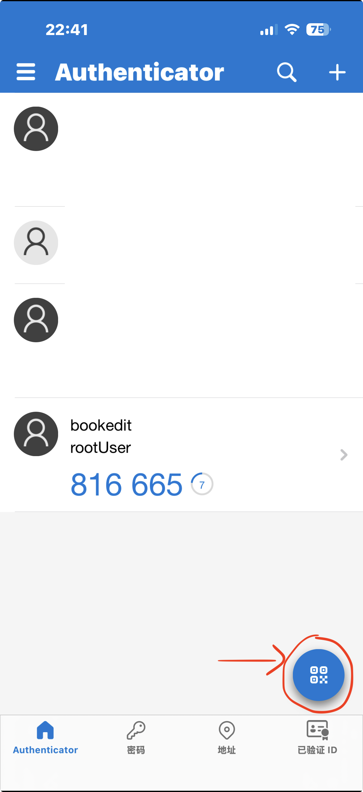

# 动态校验码

动态验证码是一种常用的二次验证方式，由于本项目无后端，所以密钥也保存在了前端，删除等操作的验证仅仅是为了防止误操作，如果需要加强安全，请将密钥保存在后端进行校验。

如果需要修改校验码密钥，请修改BookEdit.vue中totpSecret变量，然后重新打包

如何获取动态口令，手机下载应用[Authenticator](https://apps.apple.com/cn/app/microsoft-authenticator/id983156458)

点击右下角的二维码按钮，扫描本页面的二维码

扫描后列表中将出现绘本编辑器的动态验证码

::: tip
- 如果修改了默认的校验码密钥，上面的二维码将失效，请在应用中手动输入所修改的密钥
- 或将下面这行字符串生成新的二维码扫描
- otpauth://totp/绘本编辑器:rootUser?secret=这里替换成新的密钥&issuer=bookedit
:::

