# 输入节点
输入节点通常为用于输入信息到蓝图中，是蓝图逻辑的触发入口，比如输入一个数值

## 数值
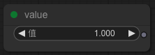
输出一个数，可点击输入想要的数值，也可以点击左右箭头修改数值

## 文字
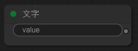
输出一段文本，可点击输入文本内容

## 布尔值
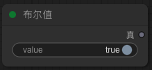
输出一个状态开或者关，点击可切换开关

## 开始时
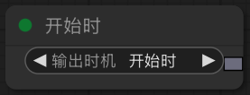
可选三个输出时机触发
 - 开始前，所有物体节点初始化阶段，此时物体还在加载资源，如涉及物体动画播放等操作，不要在此时执行
 - 开始时，所有物体节点已经初始化完成，可以操作物体，但剩余节点不一定都初始化完成
 - 开始后，所有节点已经初始化完成，并且分镜运行了一帧

## 按下按键
    
### 按钮
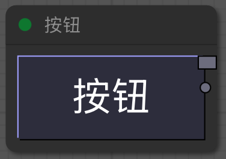
生成一个可以在蓝图中点击的按钮，点击时触发
### 摇杆
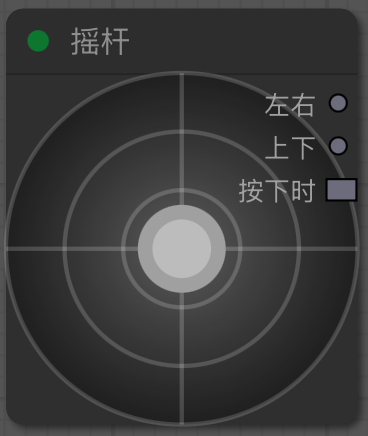
生成一个可以在蓝图中控制的摇杆，可以控制上下左右，当触发时输出
## 触摸屏

### 触摸开始
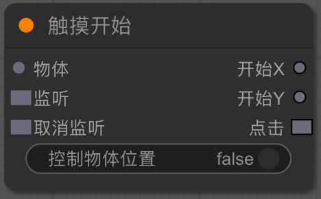
- 物体：当未关联物体时，监听的是屏幕触摸开始，关联物体时，监听的是物体触摸开始
- 监听：触发后开始监听事件
- 取消监听：触发后停止监听事件
- 开始X：输出触摸开始时的X轴坐标
- 开始Y：输出触摸开始时的Y轴坐标
- 点击：触摸开始时触发
- 控制物体的位置：激活后，如果当前有关联物体，将自动修改物体的位置到触摸的位置

### 触摸移动
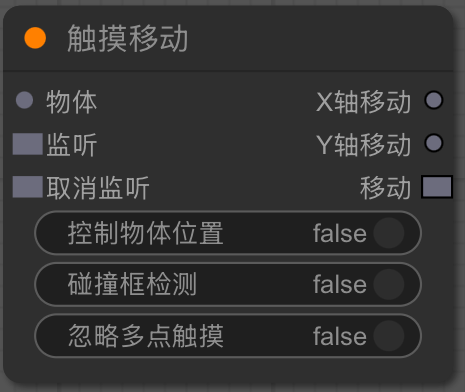
- 物体：当未关联物体时，监听的是屏幕触摸移动，关联物体时，监听的是物体触摸移动
- 监听：触发后开始监听事件
- 取消监听：触发后停止监听事件
- X轴移动：输出触摸移动时的X轴坐标
- Y轴移动：输出触摸移动时的Y轴坐标
- 移动：触摸移动时触发
- 控制物体的位置：激活后，如果当前有关联物体，将自动修改物体的位置到触摸的位置
- 碰撞框检测：激活后，如果当前有关联物体，且物体有碰撞框，只有触摸位置在碰撞框内才会触发触摸移动
- 忽略多点触摸：激活后，当有多个触摸点时，忽略响应
### 触摸结束

- 物体：当未关联物体时，监听的是屏幕触摸移动，关联物体时，监听的是物体触摸结束
- 监听：触发后开始监听事件
- 取消监听：触发后停止监听事件
- 结束X：输出触摸结束时的X轴坐标
- 结束Y：输出触摸结束时的Y轴坐标
- 结束：触摸结束时触发
- 点击结束：如果此次触摸从开始到结束，未发生触摸移动时触发
- 移动结束：如果此次触摸从开始到结束，发生了触摸移动时触发
- 控制物体的位置：激活后，如果当前有关联物体，将自动修改物体的位置到触摸的位置
- 响应触摸取消：激活后，如果触摸结束时的触摸位置在物体之外，也将触发触摸结束事件

## 获取数据

### 系统数据
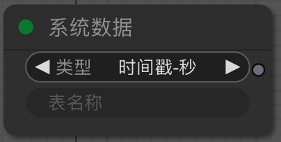
- 类型：可选择一些已经预置的系统数值
    - 时间戳-秒：返回当前时间戳，精确到秒
    - 年：月：日：返回当前日期
    - 时：分：秒：返回当前时间
    - 时：分：返回当前时间，不含秒
    - 系统：返回当前设备的系统
    - 版本：返回当前应用的版本
    - 配置表：获取应用中的配置表
    - Object：返回一个空对象
    - Array：返回一个空数组
    - 空间宽度：返回当前运行界面的宽度
    - 空间高度：返回当前运行界面的高度
    - 空间X轴范围：返回当前运行界面的X轴范围
    - 空间Y轴范围：返回当前运行界面的Y轴范围
- 表名称：如果选择类型为配置表，填写表名称后可以获取应用中的配置表
### 自定义数据
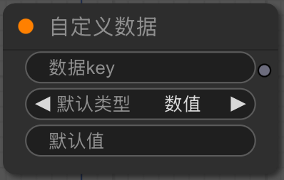
获取一个记录在本地持久化储存中的自定义数据
- 数据Key：数据保存在本地的名称，一般为英文
- 默认类型：当本地没有此数据的记录时，默认创建的数据类型
- 默认值：当本地没有此数据的记录时，默认创建的数据值，如果是字典或数组类型，将对默认值进行JSON.parse()操作

要保存自定义数据到本地，请参考输出节点的[保存自定义数据](./node-output.md#保存自定义数据)

## 重力感应
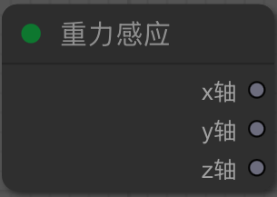
获取当前设备的重力感应值，如果设备不支持重力感应，所有轴的值将默认输出为0，如果支持，xyz轴的值应该输出为[-1，1]之间
## 屏幕适配
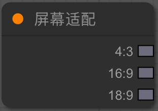
当蓝图运行时，屏幕适配会根据当前运行的窗口比例触发对应输出
- 4:3通常为pad的尺寸
- 16:9为常规显示器的尺寸
- 18:9为全面屏手机的尺寸