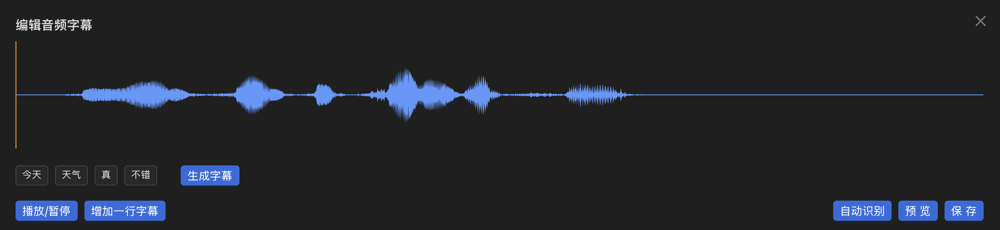
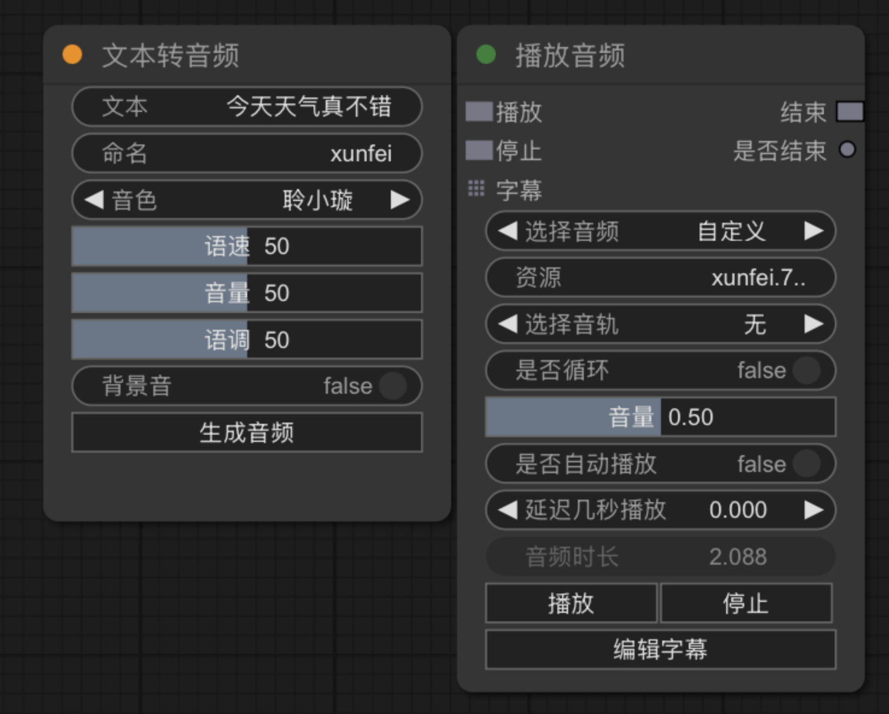

# 输出节点

## 提示

  ### 文字提示

  ### 确认框

  ### 触摸提示

  ### 输出控制台

## 游戏控制

  ### 重新开始

  ### 切换页面

  ### 页面结束

  ### 通知绘本操作

## 时间控制

  ### 停止时间

  ### 时间缩放

## 脚本组件

## 屏蔽触摸

## 播放音频

此节点用于播放音频，当选择音轨为无时，其他音频播放时，不会打断此音频播放，当选择某一个音轨时，其他对应音轨的音频节点播放讲打断此音频节点的播放。
如果需要为此音频添加字幕，可点击底部的`编辑字幕`按钮，在弹出的界面中可以手动添加字幕及卡点，也可以使用讯飞接口自动识别文本和时间点：

点击`自动识别`后，稍等片刻，上方会出现识别结果，如果字幕无需换行，可直接点击`生成字幕`按钮，如果需要换行，就点击对应换行位置的词语标签，即可生成多行字幕。

## 文本转音频

输入需要生成的文本，点击`生成音频`按钮，会在右侧自动生成播放音频的节点，（注意，此功能需要开通[讯飞文本转音频接口服务](https://www.xfyun.cn/services/smart-tts)）

## 振动

## 自动点击

## 保存自定义数据

  

