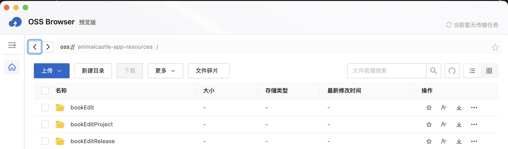

# 快速部署
此篇内容仅针对需要二次开发部署的程序员，如果你只需要学习如何使用此工具，请前往[快速上手](./quick-use)

首先前往[Github](https://github.com/HelloMole/bookEdit)克隆此项目到本地。

此项目基于[Vue3](https://vuejs.org)构建，如果需要扩展开发，请参考Vue开发文档。

此项目使用的[Nodejs](https://nodejs.org/zh-cn/download)版本`v18.20.8`，请先安装node环境，如果遇到报错，请检查node版本是否匹配。

此项目针对[Cocos Creator2.4.10](https://docs.cocos.com/creator/2.4/manual/zh/)进行开发，如果需要使用3.0以上版本，理论上也可适配，但可能需要手动修改部分Api

下载好项目后，进入项目目录，执行操作

```cmd
npm install
```

安装依赖成功后，启动服务
```cmd
npm run dev
```

如果需要构建网页部署
```cmd
npm run buildEdit
```
构建成功后生成的网页在dist文件夹下，可以手动部署（把dist目录下的文件上传到oss中）

如果已经有使用阿里云的oss容器，可配置ossConfig和upToOss.mjs中的ossBaseUrl(页面上传的路径)
需要下载[ossutil](https://help.aliyun.com/zh/oss/developer-reference/install-ossutil2)并放置在目录下，如果是mac系统，ossutil的名称应该是ossutilmac64，如果是windows系统，ossutil的名称应该是ossutil64.exe

```cmd
npm run deployEdit
```

可以打开网站后，因为所有内容都需要保存在云端，还需要在oss容器中新建几个文件夹

 - bookEdit：所有上传的图片、spine、音频等资源都保存在这里
 - bookEditProject：开发阶段每个项目的json文件都保存在这里
 - bookEditRelease：点击发布后，会将bookEditProject中的对应项目的文件同步到此文件夹下


## More

::: tip
将打包后的网站上传到oss容器后，在浏览器中直接打开链接可能会变成下载html文件，而不是打开为网站，[解决方案](https://developer.aliyun.com/ask/233137)
:::

::: tip
如何替换CocosCreator版本，打开编辑器并新建一个空项目，发布平台选择Web Desktop，构建完成后，将构建好的文件替换此项目的src/cocosBuild文件夹下的文件，将assets文件夹单独放在此项目的public文件夹下。
:::