# 快速上手

## 首次使用的设置

进入绘本编辑器主页，首先需要进行系统设置，点击右上角的`系统设置`按钮
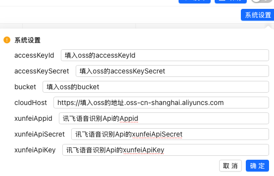

此工具需要使用云端保存功能才能正常使用，需要开通[阿里云oss](https://www.aliyun.com/activity/storage/promotion01)，并填入对应信息

如果需要使用自动生成字幕的语音转换为文本功能，以及文本生成配音功能，前往讯飞官网开通[语音识别接口](https://www.xfyun.cn/doc/asr/voicedictation/API.html#接口说明)

## 绘本列表界面
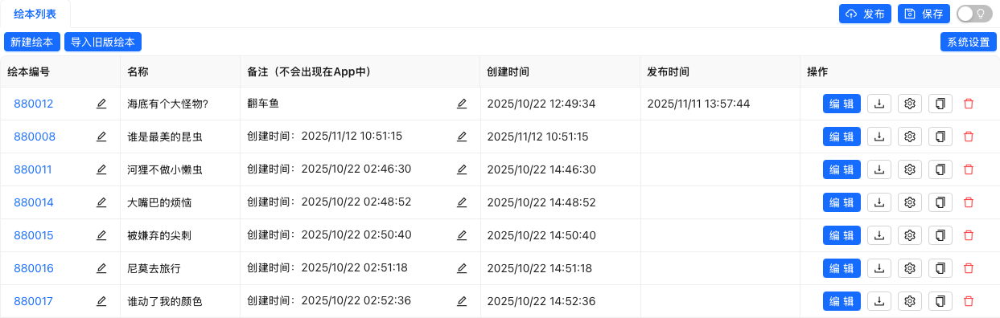

这是界面首页，左上角有个常驻标签页`绘本列表`，右侧可以点击`发布`，`保存`，还有切换深色模式的按钮

当`绘本列表`被选中时，下方显示的表格是所有绘本列表，包含一些绘本信息。表格最后一列是相关操作

- 编辑：点击进入编辑绘本
- 下载：下载绘本json文件到本地
- 设置：修改绘本相关配置
- 复制：复制当前绘本并创建新的
- 删除：删除绘本

## 创建新绘本
需要新建一本空绘本时，点击左上角的`新建绘本`，在弹窗中输入绘本编号和绘本备注，然后点击确定

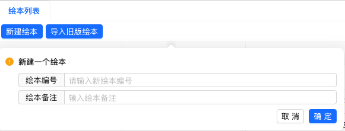

> [!WARNING]
> 绘本编号不可以和已有绘本的编号重复

## 编辑界面
点击新建的绘本编号，或这一行右侧的`编辑`按钮进入编辑界面
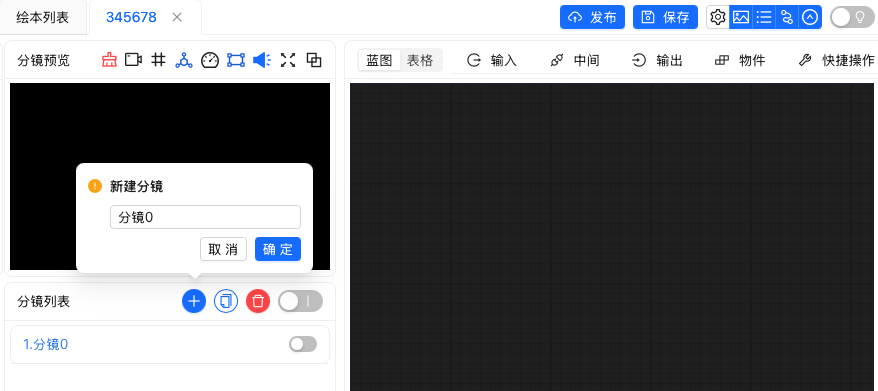

### 导航栏介绍
- 页面顶部是导航栏，当前打开的绘本标签页会处于选中状态

- 所有绘本都保存在两个目录下，其中开发目录应该只由绘本编辑者可见，发布目录下的是所有用户可见。

    - `保存`：点击后将保存当前绘本到开发目录下。
    - `发布`：点击后将保存，并且同步当前绘本到发布目录下。

- 编辑页面下，除了原本有的`发布保存`按钮，和`切换深色模式`按钮，导航栏右侧新增一组icon按钮可以控制编辑界面内哪些面板显示哪些面板不显示
    1. 绘本配置：修改绘本相关配置的面板
    2. 分镜预览：显示cocos画面预览
    3. 分镜列表：显示当前绘本下的所有分镜
    4. 蓝图/表格面板：编辑操作的主要地方，此面板不支持关闭
    5. 导航栏：点击可收起导航栏，需要显示导航栏时，此按钮位于编辑面板最右侧

    
   

### 分镜预览面板介绍
- 分镜预览会显示当前分镜中创建的所有物体，也会响应蓝图中编辑的操作和运行
- 面板顶部有一排按钮，从左到右依次是
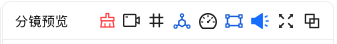
 1. 清空场景：点击会清除当前预览中所有物体，在切换分镜时出现显示异常时可点击清空
 2. 激活摄像机预览：当分镜中使用了镜头节点，激活时可查看真实的镜头效果，未激活时镜头会以一个蓝框进行显示。
 3. 显示安全框：激活时预览窗口将显示红色安全框，方便判断画面在不同比例的屏幕中显示的效果
 4. 显示节点树: 显示当前场景下的物体节点树，适合调试时使用
 5. 显示帧率信息: 显示帧率等信息，适合调试时使用
 6. 显示碰撞框: 显示物体的碰撞框，用于判断物体的碰撞框是否添加在正确位置
 7. 声音：激活状态播放音频有声音，未激活状态将静音预览
 8. 缩放预览框大小：点击后可将预览框从固定模式变成自由模式，可拖动右下角调整大小，拖动标题移动面板位置。
 9. 在单独窗口预览：点击后会打开一个独立的新窗口进行预览

### 分镜列表面板介绍
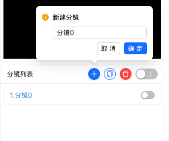

- 分镜列表中每一行表示一个分镜，选中的分镜标题为蓝色，点击标题可选中分镜，蓝图和分镜预览面板中的内容也会切换为当前选中的分镜，
- 分镜的顺序从上到下，可按住分镜名称上下拖拽调整分镜顺序
- 每个分镜最右侧有一个开关，关闭状态时表示此分镜不会在App运行时出现在绘本中。
- 面板顶部右侧是一排操作按钮，
    1. +按钮：可新建一个空分镜，在弹出的窗口中填入分镜名称点击确定即可。
    2. 复制按钮：可复制当前选中的分镜
    3. 删除按钮：可删除当前选中的分镜

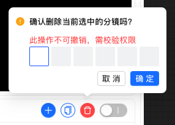
在执行删除操作时，删除后不可撤销操作，为防止误操作，需联系管理员获取[动态校验码](./authcode.md)。

### 蓝图表格面板
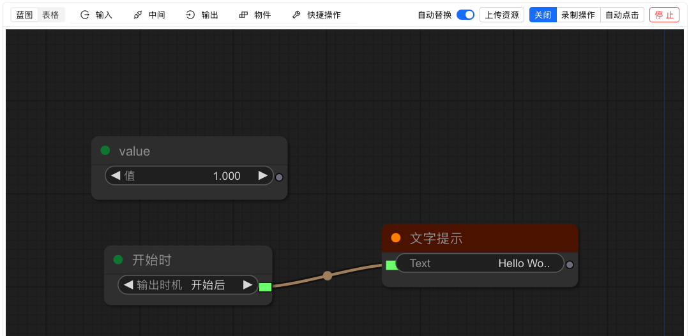

- 面板顶部的按钮功能说明：
    - `蓝图/表格`：点击切换当前的编辑模式，蓝图模式是拖拽节点的形式，表格模式会将节点自动转换成表格显示
    - `输入`：点击展开输入分类下的节点选项，此分类下的节点一般用于输入数据
    - `中间`：点击展开中间分类下的节点选项，此分类下的节点一般用于逻辑的处理
    - `输出`：点击展开输出分类下的节点选项，此分类下的节点一般用于蓝图连线的结束阶段，不会明显影响蓝图中的逻辑
    - `物体`：点击展开物体分类下的节点选项，此分类下的节点一般是和Cocos Creator组件相关。
    - `快捷操作`：点击展开快捷操作菜单栏，点击执行对应操作

    - `自动替换`：点击切换是否替换同名的资源，开启时，上传的资源如果已经在蓝图中有同名称的，将自动替换旧的资源
    - `上传资源`：点击调用浏览器的选择文件弹窗，目前支持的资源种类和格式有：
        1. 图片：.png、.jpg、.jpeg
        2. 音频：.mp3、.wav
        3. spine动画：上传spine动画需同时上传三个文件：.json，.atlas，.spine
        ::: tip
        除了点击上传资源，也可以直接从系统文件夹拖拽文件到蓝图编辑的黑色界面中来上传资源
        :::
    - `关闭/录制操作/自动点击`：这是一个单选按钮
        - 选中关闭状态时，无效果
        - 选中录制操作，此时运行蓝图，将自动录制分镜预览面板中物体的点击操作，点击结束运行时，将自动结束保存录制结果，如果再次点击运行蓝图，将覆盖当前分镜的操作录制。（录制结束后，蓝图中将自动加入一个【自动点击】节点）
        - 选中自动点击，此时运行蓝图，将自动执行录制好的分镜点按操作（如果当前分镜已有录制的话）
    - `运行/停止`：点击运行或停止运行当前分镜的蓝图

- 在蓝图编辑状态时，鼠标右键单击任意空白处，也可打开添加节点的菜单
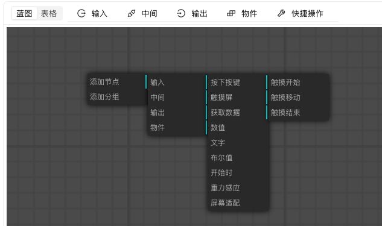

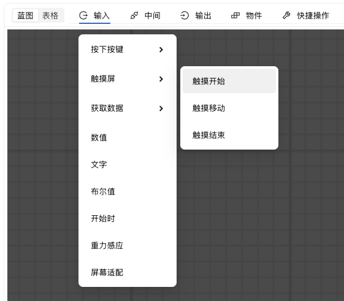
以上两种菜单栏是一样的功能

## 创建一个最简单的蓝图
1. 点击蓝图面板顶部的菜单->输入->开始时，创建一个输入节点
2. 点击蓝图面板顶部的菜单->输出->提示->文字提示，创建一个输出节点
3. 将蓝图中的开始时节点右侧的输出连接到文字提示节点左侧的输入
4. 修改文字提示节点中的Text属性为Hello World
5. 点击运行，窗口顶部将弹出提示
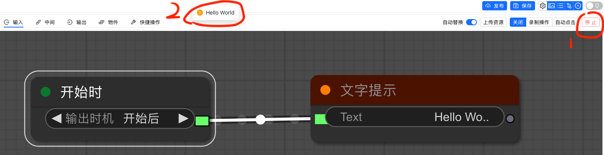

上面是一个最简单的蓝图逻辑，在开始运行的时候弹出一个提示，
但这个蓝图还没有和Cocos产生关联，下一篇将制作一个可以在分镜预览中看到物体的蓝图。

